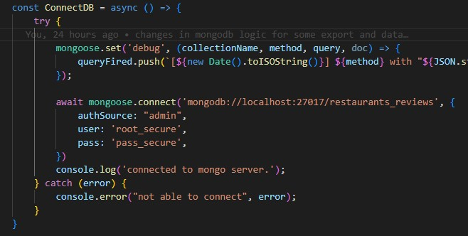
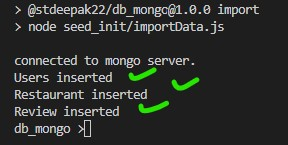
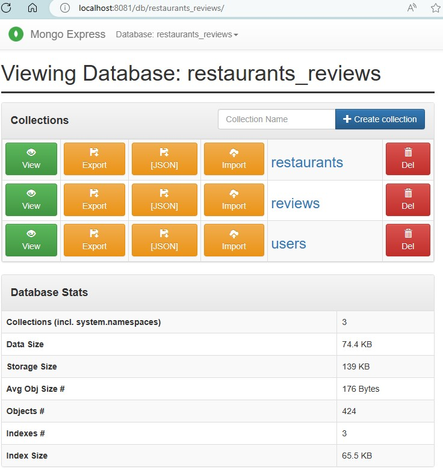
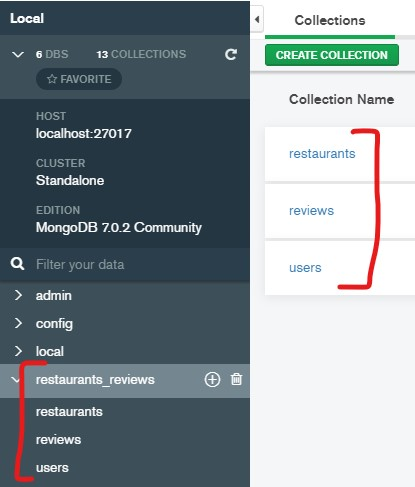
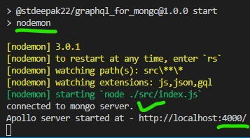
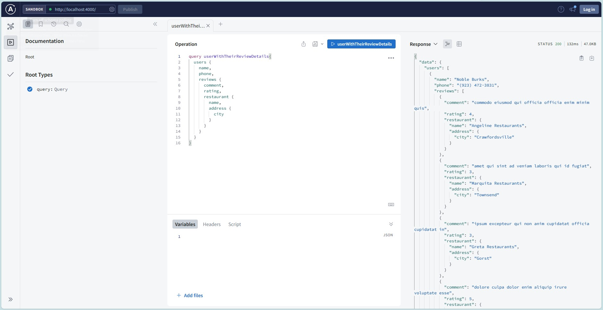
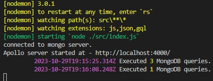

# GraphQL on MongoDB.

Using npm package [apollo](https://www.npmjs.com/package/@apollo/server) to create graphql server. This is not something used for production, but a hobby project, and definitely there are thousands of chances/way to improve it further. eg. use the express rather the standalone server provided by apollo itself.

Though I tried covering most of the important thing to keep in mind, while creating GraphQL server. If you have other suggestion, dont hesitate to raise PR.

## Code and Directory
This repository has mainly 2 directories.
* `db_mongo`
* `graphsql_for_mongo`

as name clearly indicate, `db_mongo` contains the mongo related stuff (temp data import, connection, and fetch) and `graphql_for_mongo` this one use `db_mongo` as npm package (via `npm link`), and mainly focus on graphql stuff.

## npm install

install the node modules for both the directory using `npm install`. 
> db_mongo > `npm install`

> graphql_for_mongo > `npm install`

## prepare and start mongodb

if you don't have mongo db installed locally, and have docker installed, you can get mongodb container up and running in minutes using the `docker-compose.yaml` file available at -
> `db_mongo\seed_init\docker-compose.yaml`

it will download docker image, and will start container of `mongodb` and `mongo-express` (for exploring the database).  It will configure the credentials of DB (`inside "admin" database`) as following - 

* user name = `root_secure`
* password = `pass_secure`

File `mongooseConnection.js` is having configuration about db server, and its credentails, if you are using locally installed mongodb, make sure you change the configuration as per your mongodb server in this file. This `mongooseConnection.js` file is available at -
> `db_mongo\src\db\mongooseConnection.js`

we are using the npm package [mongoose](https://www.npmjs.com/package/mongoose) to connect to mongodb, and query it. DB we are using for this exercise is `restaurants_reviews`.

Now when we have mongodb up and running, we'll import some dummy data to this `restaurants_reviews` db. There are mainly 3 entities - `User`, `Review` by user for a restaurant, and `Restaurant` itself. Dummy json data has linked among these entities, and json files are available at `db_mongo\seed_init\dummy-data\` 

* `30_Users.json` - this contains 30 users, with some basic user's properties eg. `name`, `email`, `phone` etc.
* `100_Restaurants.json` - this contains 100 restaurants, with some properties, and `id` of reviews for each restaurants if any.
* `294_Reviews.json` - this contains 294 reviews by some users from above 30 users list, for above 100 restaurants.

Now lets import this dummy data to 3 collections by running below script - 
> `npm run import`

which will eventually execute the logic written in `db_mongo\seed_init\importData.js` file. If everything went well, we will see something like below - 

and now lets see the DB and collections - 

* if you used the above docker compose file, then you can open `mongo-express` at port `8081` http://localhost:8081, and see the db/collections. If it ask for credentails, default credentails are `admin` and `pass`

* if you have [MongoDB Compass](https://www.mongodb.com/products/tools/compass), you can use that as well to see the DB and its collections.

## start GraphQL
now when we have mongo db up and running with dummy data in db `restaurants_reviews`, let's start the apollo standandalone server (using `npm start`) at port `4000` (configured inside `graphql_for_mongo\src\index.js`) and test graphql queries.

> graphql_for_mongo > `npm start`

`Note: ` We are using the [nodemon](https://www.npmjs.com/package/nodemon) to restart "`npm start`" if we modify any `js`, `json` or `gql` file.

Lets open graphQL testing client provided by apollo server at http://localhost:4000 and fire the graphql query and see the result - 

## Bonus Point - 
On your terminal (where you started apollo server using `npm start`) you can see how many queries are fired overall for that GraphQL query, remembers its optimized using the [dataloader](https://www.npmjs.com/package/dataloader).

